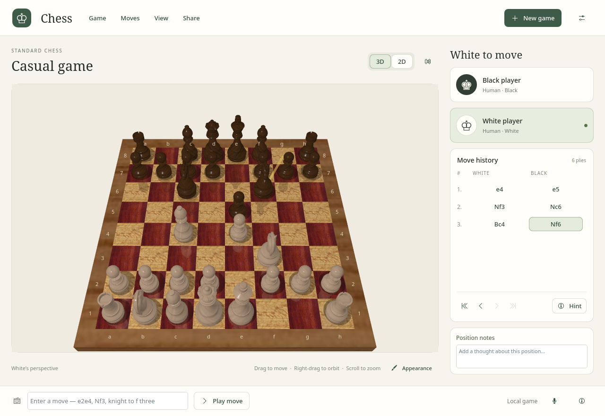
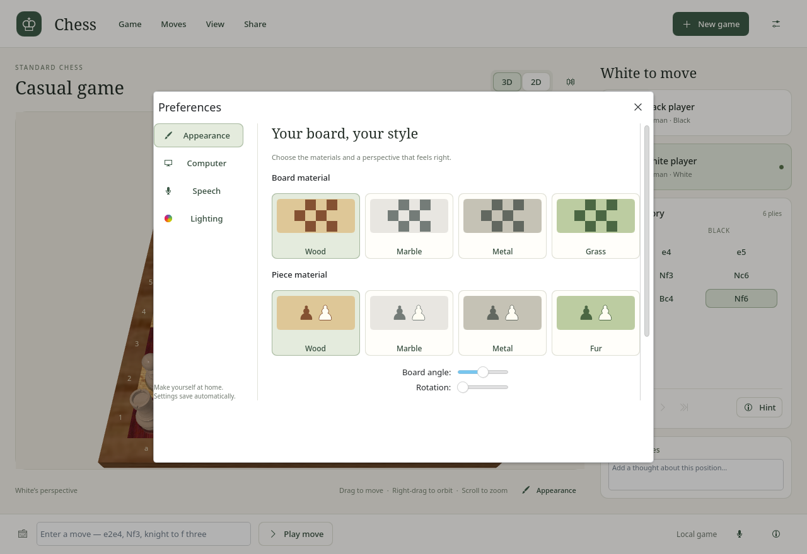
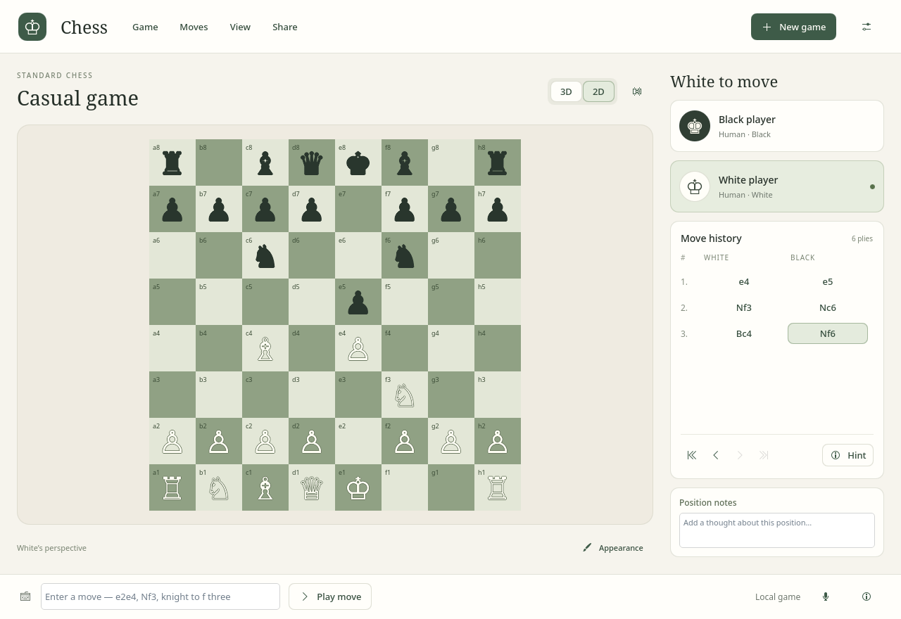

# Chess for Linux

A native Linux rebuild of Apple's Chess application, with a **Kirigami** desktop interface, **Rust** game controller and engine, and **Vulkan** 3D renderer. Play against the computer or a friend, explore four chess variants, and customize the board with the original piece geometry and artwork. Runs on **Wayland and X11**.



[Getting started](#getting-started) · [Features](#features) · [Screenshots](#screenshots) · [Controls](#controls) · [Linux guide](README.linux.md) · [Licenses](#licenses-and-origin)

## Features

- **Four variants:** Standard, Crazyhouse, Suicide, and Losers, with variant-specific rules, promotions, and game results.
- **Flexible opponents:** play locally with two humans, choose either computer side, or watch computer versus computer. Adjust thinking time and search depth; optionally use the original Sjeng engine.
- **Interactive 3D board:** click or drag pieces, orbit the camera, and zoom. Vulkan rendering includes reflections, shadows, animated moves, and antialiasing.
- **Custom appearance:** choose Wood, Marble, Metal, or Grass boards and Wood, Marble, Metal, or Fur pieces. Tune lighting and materials independently.
- **Review and analysis:** move history, hints, undo/redo, comments, and saved alternative continuations.
- **Game documents:** multiple tabs, recent files, session recovery, native `.chess-linux` saves, Apple `.chess` import/export, and single-game PGN import/export.
- **Play over TCP:** direct two-player sessions with chat, draw offers, agreed takebacks, and resignation.
- **Accessible 2D view:** labelled Qt square buttons, keyboard navigation, and Qt accessibility support for Linux screen readers.
- **Optional extras:** spoken moves, offline microphone input, PNG screenshots, MP4 recording, desktop notifications, and a local JSON scripting interface.

## Getting started

### Requirements

- Linux with a Wayland or X11 desktop session.
- Rust **1.95 or newer**, Cargo, a C++17 compiler and pkg-config.
- **Qt 6.5 or newer** development packages for Qt Quick, QML and Quick Controls, including `moc` and `rcc`.
- **KDE Kirigami 6** and **qqc2-desktop-style** QML modules at runtime.
- A working **Vulkan driver and loader** for your GPU.
- A desktop platform integration or XDG desktop portal for native file dialogs.

On Arch Linux or CachyOS, install the desktop build dependencies with:

```sh
sudo pacman -S --needed base-devel qt6-base qt6-declarative kirigami qqc2-desktop-style
```

### Build and run

From the repository root:

```sh
cargo build --release --locked
./target/release/chess-linux
```

The artwork, QML interface and Noto fonts are embedded in the binary; Qt and Kirigami are system dependencies. You can also open a saved game directly or start without restoring the previous session:

```sh
./target/release/chess-linux game.pgn
./target/release/chess-linux game.chess
./target/release/chess-linux --fresh
```

### Install locally

```sh
./scripts/install.sh
```

This builds the release binary and installs the application, desktop launcher, icon, file associations, and documentation into `~/.local`. Ensure `~/.local/bin` is in your `PATH`. Use `PREFIX=/path ./scripts/install.sh` to choose another installation directory.

See the [Linux guide](README.linux.md) for optional dependencies, file compatibility, networking, scripting, and verification details.

## Screenshots

These captures show the native Kirigami desktop application: material choices in Preferences and the accessible 2D board with player cards and move history.

| Appearance settings | Accessible 2D board |
| --- | --- |
|  |  |

## Controls

| Action | Control |
| --- | --- |
| Move a piece | Click a piece and its destination, or drag it |
| Rotate and tilt the board | Right-drag |
| Zoom | Scroll |
| Turn the board around | **F** |
| New / open / save game | **Ctrl+N** / **Ctrl+O** / **Ctrl+S** |
| Undo / redo | **Ctrl+Z** / **Ctrl+Shift+Z** |
| Show hint / last move | **]** / **[** |
| Select a square with the keyboard | Arrow keys, then **Enter** |
| Clear selection | **Escape** |
| Full screen | **F11** |

The command field accepts UCI moves (`e2e4`), SAN (`Nf3`, `O-O`), Crazyhouse drops (`N@e4`), and phrases such as `knight to f three` or `take back move`. In Crazyhouse, you can also select a captured piece from the pocket and click its drop square.

Open **Preferences** to change materials, switch to the 2D board, choose computer players, or set up speech. Reviewing history pauses computer play; choose **Resume** to continue.

## Optional integrations

| Integration | Setup |
| --- | --- |
| Original Sjeng engine | Run `./scripts/build-sjeng.sh`, then set the absolute path to `target/sjeng/sjeng` in Preferences. Requires a C compiler and GDBM compatibility development headers/libraries. |
| Spoken moves | Install `espeak` and enable speech in Preferences. |
| Offline voice input | Install Python 3, `vosk`, and `sounddevice`; set a compatible local Vosk model folder in Preferences. |
| MP4 recording | Install `ffmpeg` with the `libx264` encoder, then use **Share → Record game**. |
| Desktop notifications | Install `notify-send`. |

The built-in Rust engine, board play, and document handling work without these optional integrations. Direct TCP play connects Linux instances; it does not connect to Apple's SharePlay or Game Center services.

## Development and verification

Run the standard checks:

```sh
./scripts/check.sh
```

This checks formatting, Clippy, automated tests, and an offscreen Vulkan render. With a working desktop session, Python 3, and ffmpeg, also exercise the native GUI and two-instance network play:

```sh
CHESS_GUI_CHECK=1 ./scripts/check.sh
```

For a standalone renderer check:

```sh
./target/release/chess-linux --render-check board.png
```

Generated verification output goes into the ignored `artifacts/` directory. README screenshots live in [`docs/images/`](docs/images/).

| Source | Purpose |
| --- | --- |
| [`qml/`](qml/), [`src/kirigami.rs`](src/kirigami.rs), [`native/`](native/) | Kirigami interface, Rust application controller and small Qt bridge |
| [`src/app.rs`](src/app.rs) | Shared preferences/recovery and optional previous egui interface (`--egui`) |
| [`src/game.rs`](src/game.rs), [`src/document.rs`](src/document.rs) | Rules, history, and game documents |
| [`src/engine.rs`](src/engine.rs), [`src/legacy_engine.rs`](src/legacy_engine.rs) | Rust search and optional Sjeng adapter |
| [`src/render.rs`](src/render.rs), [`src/board.wgsl`](src/board.wgsl) | Vulkan rendering and shaders |
| [`src/network.rs`](src/network.rs), [`src/speech.rs`](src/speech.rs), [`src/recording.rs`](src/recording.rs), [`src/automation.rs`](src/automation.rs) | Network play, speech, recording, and scripting |
| [`scripts/`](scripts/) | Installation, checks, and asset conversion |

## Licenses and origin

This repository retains the source for Apple's Chess.app 3.0, shipped with Mac OS X 10.8, alongside the Linux rebuild.

- **New Rust application, QML interface and Qt bridge:** [GNU GPL version 3 or later](LICENSE).
- **Bundled Noto fonts:** [SIL Open Font License 1.1](assets/fonts/LICENSE).
- **Original Apple frontend, artwork, and piece geometry:** Apple Sample Code License, preserved in the original [`README`](README).
- **Original Sjeng engine:** GNU GPL version 2 or later; see [`sjeng/COPYING`](sjeng/COPYING).

See [`NOTICE`](NOTICE) for attribution and component details. This port is not endorsed by Apple.
